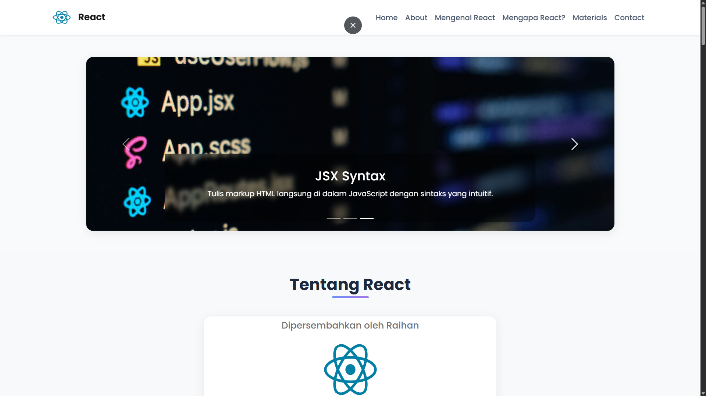
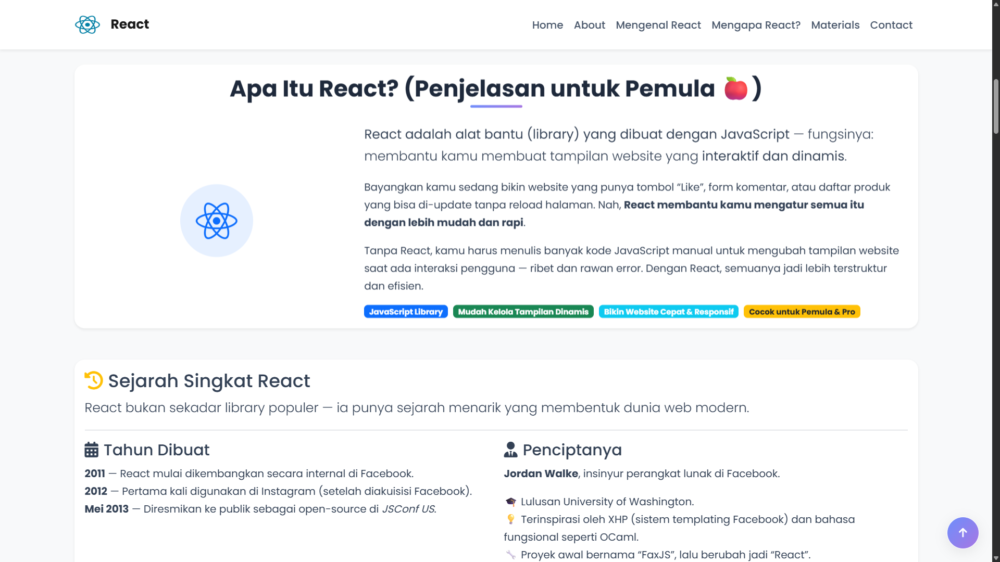
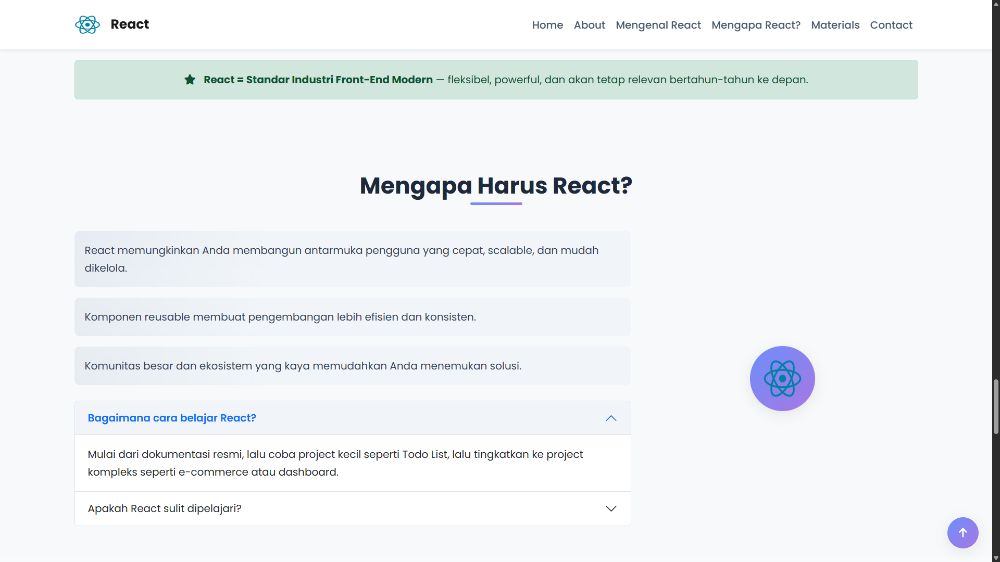
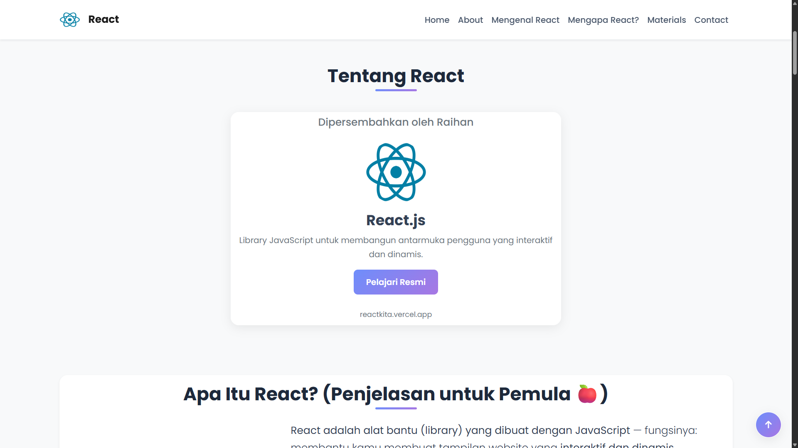

# 🚀 Portofolio: Mengenal Framework Web Modern

> **"Bangun UI Dinamis dengan React — Dari Pemula Hingga Mahir"**  
> *Tugas Mata Pelajaran Front-End | Oleh Raihan X Visualcodepo*

[](https://react.dev)
[](https://getbootstrap.com)
[](https://developer.mozilla.org/en-US/docs/Web/JavaScript)
[](https://html.spec.whatwg.org/)
[](LICENSE)

---

## 📌 Deskripsi Proyek

Website ini adalah **portofolio interaktif** yang dirancang untuk memperkenalkan konsep dasar dan keunggulan **React.js** sebagai framework web modern, khususnya untuk pemula. Dirancang dengan **Bootstrap 5**, **CSS custom**, dan **JavaScript murni**, website ini tidak hanya informatif tetapi juga menghadirkan pengalaman pengguna yang halus, responsif, dan estetis.

Dengan desain yang modern, animasi halus, accordion interaktif, carousel dinamis, dan formulir kontak fungsional, proyek ini menjadi **contoh sempurna** bagaimana teknologi front-end bekerja bersama untuk menciptakan situs edukasi yang menarik dan profesional.

✅ **Fitur Utama:**
- ✅ Carousel gambar dengan caption animasi
- ✅ Accordion interaktif tentang JSX, Virtual DOM, Komponen
- ✅ Card materi belajar dengan collapse detail
- ✅ Form kontak dengan validasi & notifikasi toast
- ✅ Scroll-to-top button otomatis
- ✅ Tooltip untuk ikon informasi
- ✅ Responsive design (mobile-first)
- ✅ Dark mode teks (via Prism.js) untuk kode JSX
- ✅ Animasi hover pada card, tombol, dan navbar
- ✅ Badge & warna tema konsisten (React Blue + Purple Gradient)

---

## 🗂️ Struktur Folder Proyek

Berikut adalah struktur direktori proyek yang akan Anda temukan di repositori ini:

```
react-portfolio/
│
├── index.html                  # Halaman utama website (HTML5 + Bootstrap + JS)
├── style.css                   # CSS kustom untuk styling unik (gradient, animasi, hover)
├── .hintrc                     # Konfigurasi linter HTML untuk kualitas kode
├── bootstrap/
│   ├── css/
│   │   └── bootstrap.min.css   # File CSS Bootstrap v5.2.3 (disediakan secara lokal)
│   └── js/
│       └── bootstrap.bundle.min.js # File JS Bootstrap v5.2.3 (termasuk Popper.js)
│
├── img/
│   ├── react.png               # Logo React resmi
│   ├── 1.jpg, 2.jpg, 3.jpg     # Gambar carousel (JSX, Virtual DOM, Components)
│   └── ...                     # Gambar pendukung lainnya (ikon, avatar)
│
└── README.md                   # Dokumentasi ini!
```

### 🔍 Penjelasan File Kunci

| File | Fungsi |
|------|--------|
| **`index.html`** | **Inti dari seluruh website.** Berisi struktur HTML lengkap dengan integrasi Bootstrap, Font Awesome, Google Fonts, dan Prism.js. Semua komponen UI (navbar, carousel, card, form, footer) didefinisikan di sini. Termasuk script JavaScript untuk scroll-to-top, tooltip, toast, dan form submit. |
| **`style.css`** | **Kustomisasi visual eksklusif.** Berisi semua variabel CSS (`:root`), animasi hover, gradient, shadow, efek card, styling badge, dan media query untuk responsivitas. Tidak menggunakan framework CSS tambahan selain Bootstrap. |
| **`.hintrc`** | **File konfigurasi linting HTML.** Memastikan kode HTML tetap rapi, valid, dan sesuai standar web (misal: tag tertutup, atribut quotes, struktur semantik). Cocok untuk tim atau penilaian akademik. |
| **`bootstrap/css/bootstrap.min.css`** | File CSS Bootstrap versi 5.2.3 yang **diunduh dan disimpan lokal** — memastikan website tetap berjalan meskipun tanpa koneksi internet. |
| **`bootstrap/js/bootstrap.bundle.min.js`** | File JavaScript Bootstrap yang sudah termasuk Popper.js. Digunakan untuk fitur interaktif seperti dropdown, modal, tooltip, toast, dan carousel. |
| **`img/`** | Direktori penyimpanan semua asset gambar: logo React, gambar carousel, dan ikon pendukung. |

---

## 💡 Inti Pembelajaran Website Ini

Website ini bukan sekadar tampilan cantik — ia adalah **pembelajaran visual**. Setiap elemen dirancang untuk menjawab pertanyaan kunci:

🔹 **Apa itu React?** → Dijelaskan dengan analogi LEGO dan pizza 🍕  
🔹 **Apa bedanya React vs Bootstrap?** → Perbandingan jelas dalam bentuk card side-by-side  
🔹 **Apa itu JSX?** → Contoh kode langsung + penjelasan satu per satu `{props.name}`  
🔹 **Apa itu Virtual DOM?** → Analogi “duplikat ringan” yang membuat UI cepat  
🔹 **Bagaimana cara belajarnya?** → Materi terstruktur: Dasar → Hooks → Project Nyata  

> **💡 Tujuan Utama:** Membuat orang yang belum pernah dengar React sama sekali bisa **memahami intinya dalam 5 menit**, dan terinspirasi untuk belajar lebih jauh.

---

## 🛠️ Cara Menjalankan Lokal

1. Unduh atau clone repositori ini:
   ```bash
   git clone https://github.com/Dikrey/reactkita.git
   ```
2. Buka folder `reactkita`.
3. Klik ganda file **`index.html`** — atau buka di browser dengan drag & drop.
4. Nikmati pengalaman belajar React yang interaktif!

> 💡 **Catatan:** Tidak perlu server atau npm install! Ini adalah website statis — semua dependensi sudah termasuk.

---

## 🎯 Target Pengguna

- Mahasiswa jurusan Teknik Informatika / Sistem Informasi
- Pemula yang ingin memahami React tanpa kebingungan
- Dosen yang ingin memberikan contoh portofolio web berkualitas
- Developer frontend yang butuh inspirasi desain edukasi

---

## 📸 Preview (Screenshot)

> 
> 
> 
> 
> 
---

## 🙌 Kontribusi

Anda bisa membantu meningkatkan proyek ini dengan:

- Menambahkan materi lanjutan (Next.js, Redux)
- Memperbaiki aksesibilitas (WCAG)
- Menambahkan bahasa alternatif (Bahasa Indonesia)
- Memberikan masukan desain

Pull Request sangat dihargai! 🙏

---

## 📜 Lisensi

Proyek ini dilisensikan di bawah lisensi **MIT** — silakan gunakan, modifikasi, dan sebarkan secara bebas untuk tujuan edukasi.

---

## 👨‍💻 Dibuat oleh

**Visualcodepo X Raihan_official0307**   
📧 raihan@example.com | 🐙 [GitHub](https://github.com/Dikrey) | 💼 [LinkedIn](https://linkedin.com/in/yourprofile)

---

> _“React bukanlah bahasa baru — tapi cara baru untuk berpikir tentang antarmuka.”_  
> — *Dipahami lewat website ini, bukan hanya dibaca.*

---

### ✅ Siap untuk dipresentasikan di kelas, dikirim ke dosen, atau ditampilkan di portofolio pribadi Anda!

---

## 🎉 Bonus: Kenapa Ini Beda?

| Fitur | Website Biasa | Website Ini |
|-------|---------------|-------------|
| **Desain** | Statik, polos | Animasi, gradient, hover effect |
| **Penjelasan** | Panjang & membosankan | Visual, analogi, kode langsung |
| **Interaktivitas** | Hanya teks | Accordion, Collapse, Toast, Tooltip |
| **Offline Ready** | ❌ Butuh CDN | ✅ Semua file lokal |
| **Profesionalitas** | Tampak tugas biasa | Terlihat seperti produk nyata |

---

✨ **Unduh, jalankan, pelajari, dan bagikan!**  
Mari kita ubah cara orang mempelajari React — dari membosankan, menjadi menyenangkan.

---
